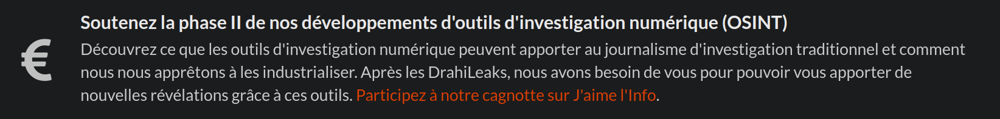
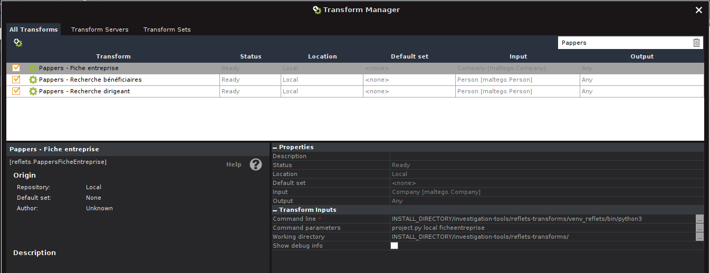
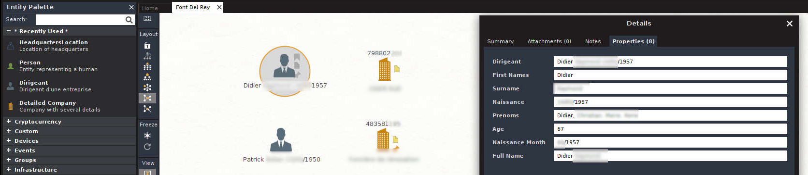

# Reflets.info Maltego Transforms

Hello community ! In this repository, you will find several Maltego Transforms designed to help investigative journalism.

Currently, you will find the following transforms :

 - Pappers.fr Transform: an exploration tool that extracts information on companies in France from the Pappers.fr databases and creates a graph based on this data.

## The stories

 Before getting to the technical stuff, if you want to learn with fun how these OSINT tools are working, you can read the following stories from real world : 

 - [Investigating compagnies throug Pappers.fr platform : a story of slum landlords](https://reflets.info/articles/osint-reflets-partage-avec-la-communaute-ses-tranforms-maltego-pour-pappers/)
 
## Installation procedure
 
### Maltego
 
You must download Maltego from https://www.maltego.com/downloads/. These transforms have been tested with **Maltego 4.6.0**.
You can use the free version (Maltego Community) by creating an account on the Maltego website. In Community version, Maltego will have some limitations :

 - you will only have access to a limited set of public tranforms. 
 - Furthermore, calling transforms **will be limited to creating 12 entities (results)**. We have optimized the result to gather the most important ones but this is a limitation. 
 
 
### Python maltego-trx library
 
 maltego-trx is the python 3 library allowing to extend Maltego by creating python Transforms. You can find it here : https://github.com/MaltegoTech/maltego-trx
 
 You just have to install the library in the system with :
 
      pip install maltego-trx
      
### Install the project

Checkout the project in a directory of your choice (example "investigation_tools") : 

     cd investigation_tools/
     git clone https://github.com/Reflets-info/maltego-tools.git
     
Go to the directory, create the virtual environnement and install the dependencies :

     cd maltego-tools/reflets-transforms/
     
     python3 -m venv venv_reflets
     source ./venv_reflets/bin/activate
     pip3 install -r requirements.txt

#### Update the project

To update the project, got to the git directory and update the code : 

     cd investigation_tools/maltego-tools/
     git pull
     
### Configure your Maltego

**WARNING** : if you update the project, you must first start you Maltego and clean the old config to be sure that the new configuration will be ok. You must go to the "Tranforms" / "Transform Manager" to delete the old transforms (CompanyPappers, PersonPappers). Then you must got to "Entities" / "Manage entities" and delete the old entities : DetailedCompany, HeadquartersAdress, Dirigeant.

You must import the Maltego configuration in the "Import | Export" tab, option "Import Config". The configuration file you have to import is located here :

     maltego-tools/maltego-config/Pappers.mtz
     
Then, you must configure the transforms path to your project directory. To do this, got to "Transforms" tab, "Transform Manager" option. Then you must type "Pappers" in the search bar and you will see two lines in the result list. Click on each of them and change the following configuration options :

- Command line : Here you must specify wich python to call. You must specify the python3 script generated by your virtual environnement. For exemple : /home/user/investigation-tools/maltego-tools/reflets-transforms/venv_reflets/bin/python3

- Working directory : Here you must specify the installation directory for your transforms. For exemple : /home/user/investigation-tools/mlatego-tools/reflets-transforms/

### Configure the Pappers API

To be able to use the Pappers.fr, you must register on their website : https://www.pappers.fr/api. You can register for free and get 100 tokens. These tokens will allow you to perform from 1 to 4 investigations a month. 

You can access to the API key in the following URL : https://www.pappers.fr/mon-compte/api. Here, you will also be able to monitor your API consumption.

Then, open the configuration file located in "investigation-tools/maltego-tools/reflets-transforms/transforms/api_keys.yml". You will see a string "PUT_YOUR_API_KEY_HERE". You can replace this string with your API KEY.

**WARNING** : some users have tell us that you need a company email (not gmail) to create a developper access to the Maltego API.
       
You are ready to go !

## Using Pappers transforms

Start a new investigation and add one of the following entity in the Dasboard. We have creatd specific "Entities" to perform accurates search using specific pivot informations. You must configure these first entities accuratly to have accurate results. Entities that are generated by the transforms are filled with necessary informations and you dont have to edit Entities later, except if you add a new one manually.

To edit Entities, double click on them and fill the following properties in the "Properties" tab.

- DetailedCompany entity : You must add the company name in "Nom" and the siret in "sirent_vat". The Siren number is the only pivot necessary and must be filled.

- Dirigeant entity : Fill the Firstname in "First names", the Lastname in "Surname". To narrow the search, it is important to fill the following properties carefully. If the entity has several firstname, fill them in "Prenoms". If you can find a birthdate, add it to the "Naissance" field in the followinf format : "DD/MM/YYYY". You can also fill the age field in "Age".
Now

You can find these informations directly in the pappers.fr website by browsing manually.

 

